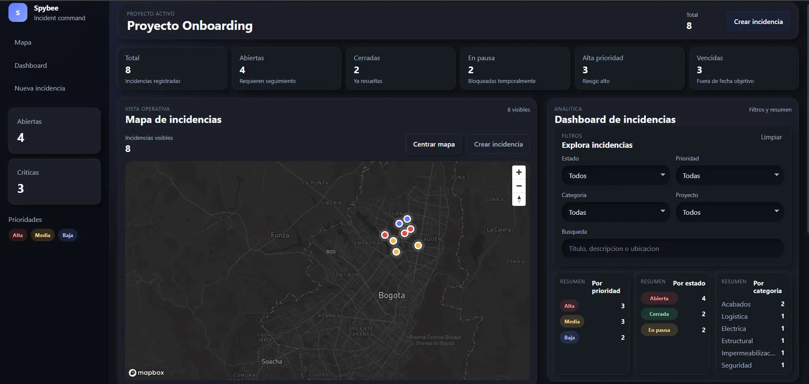
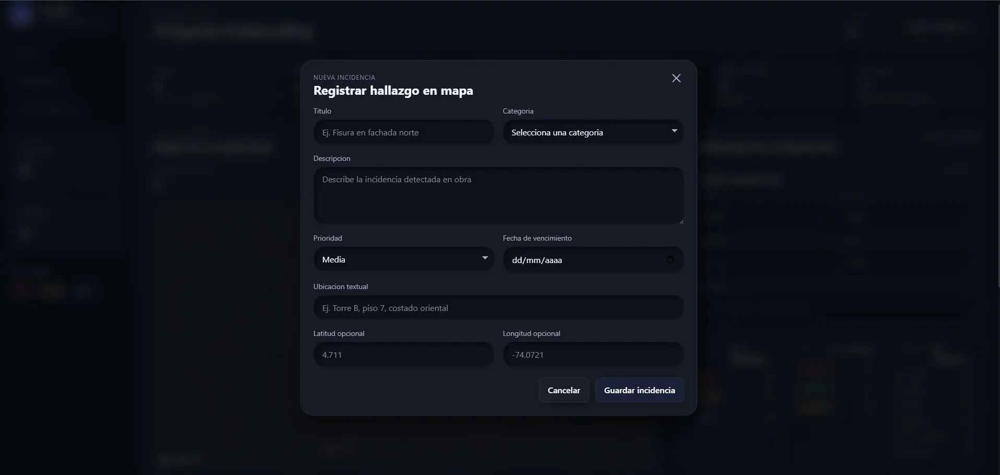
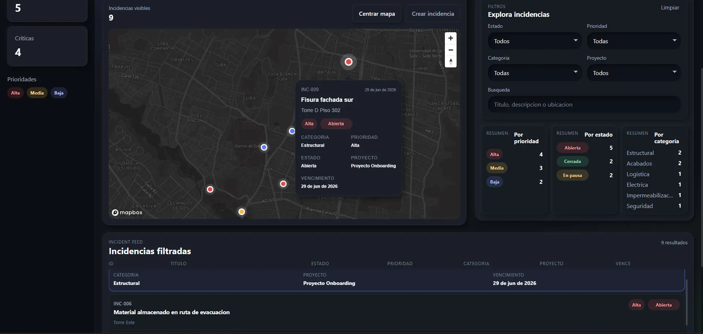

# Spybee Incidents Dashboard

Frontend application for incident management in construction projects, featuring an interactive map, incident creation flow, operational dashboard, filtering, local persistence, and marker visualization.

## Live Demo

https://spybee-frontend-technical-test.vercel.app

## Screenshots

### Dashboard



### Create Incident



### Map Popup



## Tech Stack

- Next.js App Router
- React
- TypeScript
- Zustand
- Mapbox GL
- SCSS
- Vercel

## Features

- Initial data loading from `incidents.mock.json`
- Interactive incident map with markers
- Incident creation flow from the UI
- `localStorage` persistence for user-created incidents
- Operational dashboard with KPI cards
- Filters by status, priority, category, and project
- Free-text search
- Interactive incident feed
- Incident selection from the feed
- Contextual popup on the map
- Responsive layout
- Dark UI / soft neumorphism visual style

## Environment Variables

```env
NEXT_PUBLIC_MAPBOX_TOKEN=
```

If the token is not configured, the application keeps the dashboard, filters, and feed fully operational while showing an informative map fallback state.

## Getting Started

### Install dependencies

```bash
npm install
```

### Create the environment file

macOS / Linux:

```bash
cp .env.example .env.local
```

Windows:

```bash
copy .env.example .env.local
```

### Start the development server

```bash
npm run dev
```

## Production Build

```bash
npm run build
```

## Architecture Overview

The application is organized as a client-heavy operational UI built on top of the Next.js App Router.

- `src/app` provides the application shell and route entrypoint.
- Zustand manages shared incident state, selection state, filters, and modal visibility.
- The incident dataset is initialized from local mock data and merged with user-created incidents persisted in `localStorage`.
- Map and dashboard surfaces react to the same store state, which keeps filtering, selection, KPIs, and feed interactions synchronized.
- Utility helpers centralize labels, statistics, formatting, and map-related constants to keep component rendering simple and predictable.

## User Flow

1. The app loads mock incidents from the local dataset.
2. The user can inspect incidents on the map or in the incident feed.
3. The user can filter incidents by status, priority, category, project, or text query.
4. Selecting an incident from the feed highlights it, centers the map, and opens the popup.
5. Creating a new incident updates the feed, KPIs, map markers, and popup behavior immediately.
6. User-created incidents remain available through `localStorage` persistence.

## Technical Decisions

- Zustand for shared global state across map, dashboard, feed, and create-incident modal
- `localStorage` persistence for created incidents without introducing backend dependencies
- Mapbox GL for interactive geospatial visualization
- SCSS for a custom visual system including layout, cards, badges, and UI states
- Domain-based component structure to keep the codebase modular and extensible
- Reusable helpers for labels, filters, grouping, and statistics

## Implemented Improvements

- Consistent Spanish UI labels for status and priority values
- Better incident popup hierarchy with translated labels and visual badges
- Feed-to-map interaction with selected incident synchronization
- Full-width incident feed for a more balanced dashboard layout
- Active filter chips to improve operational clarity
- Responsive refinements for desktop, tablet, and mobile breakpoints
- Improved hover, selected, and focus-visible states across interactive UI elements

## Recent UI Improvements

- Dark neumorphic visual refinement
- Improved Mapbox popup spacing and readability
- Improved dark form controls
- Refined primary button styling
- Custom favicon support
- Improved modal presentation
- Dark-mode optimized calendar picker
- Production deployment on Vercel

## Quality Checks

- Strict TypeScript setup
- Shared state handled through a single Zustand store
- Build-safe mock data loading
- `npm run lint`
- `npm run build`

## Trade-offs and Assumptions

- No backend was introduced; persistence is intentionally limited to `localStorage`
- Incident creation is optimistic and fully local by design
- The map depends on a valid public Mapbox token, but the rest of the product remains usable without it
- Filtering and KPI aggregation run on the client because the dataset is mock-based and scoped to a frontend technical assessment
- The feed is optimized for operational clarity rather than large-scale data virtualization

## Project Structure

```text
src/
├─ app/
│  ├─ globals.scss
│  ├─ layout.tsx
│  └─ page.tsx
├─ components/
│  ├─ dashboard/
│  │  ├─ CategorySummary.tsx
│  │  ├─ Dashboard.tsx
│  │  ├─ IncidentFilters.tsx
│  │  ├─ PrioritySummary.tsx
│  │  ├─ StatsCard.tsx
│  │  └─ StatusSummary.tsx
│  ├─ incidents/
│  │  ├─ CreateIncidentModal.tsx
│  │  ├─ IncidentCard.tsx
│  │  ├─ IncidentForm.tsx
│  │  └─ IncidentList.tsx
│  ├─ layout/
│  │  ├─ AppShell.tsx
│  │  ├─ Sidebar.tsx
│  │  └─ Topbar.tsx
│  ├─ map/
│  │  ├─ IncidentMap.tsx
│  │  ├─ IncidentMarker.tsx
│  │  └─ MapControls.tsx
│  └─ ui/
│     ├─ Badge.tsx
│     ├─ Button.tsx
│     └─ EmptyState.tsx
├─ data/
│  ├─ incidents.mock.json
│  └─ incidents.ts
├─ store/
│  └─ useIncidentStore.ts
├─ styles/
│  ├─ mixins.scss
│  └─ variables.scss
├─ types/
│  └─ incident.ts
└─ utils/
   ├─ formatDate.ts
   ├─ incidentLabels.ts
   ├─ incidentStats.ts
   └─ mapHelpers.ts
```

## Future Improvements

- Authentication
- Backend / API integration
- User roles and permissions
- Real media attachments
- Incident editing and closing flows
- Advanced marker clustering
- Unit tests / E2E coverage

## Notes

This technical test does not include a backend. User-created incidents are stored in `localStorage`.
